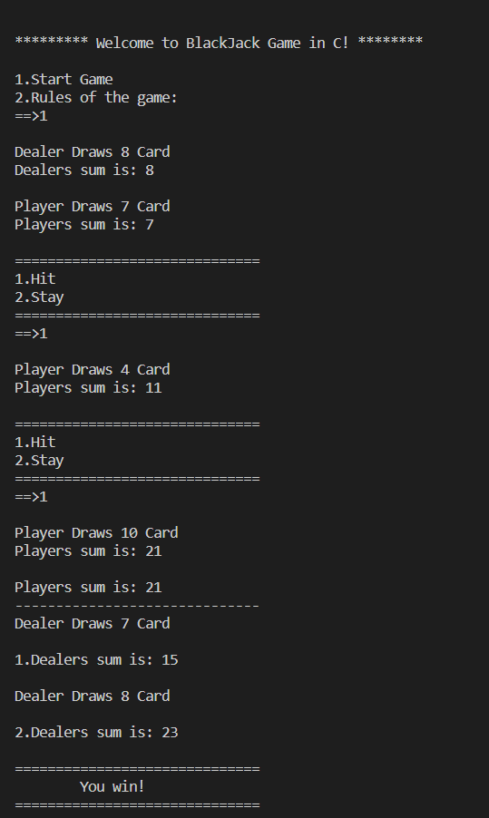

# Black Jack Game in C 
### Rules:
- When the dealer has served every player, the dealers face-down card is turned up. If the total is 17 or more, it must stand. If the total is 16 or under, they must take a card. The dealer must continue to take cards until the total is 17 or more, at which point the dealer must stand.
- Face cards each count as 10, Aces count as 1 or 11, all others count at face value. An Ace with any 10, Jack, Queen, or King is a “Blackjack.” 

## Screenshot of the game below

### To win you must
- Draw cards with sum greater than the dealers but smaller than 21 or
- Dealer draws cards greater than 21 and your sum is smaller than 21

### You lose
- If you have smaller sum than the dealer or
- You draw cards with sum more than 21

